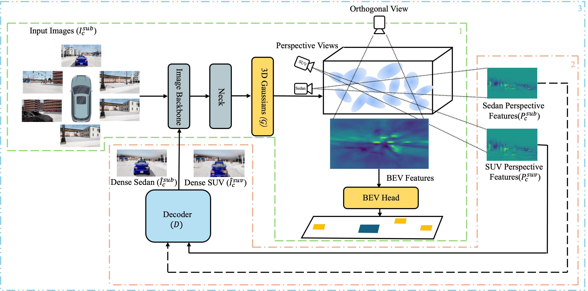

# Rig-Robust BEV Perception via 3D Gaussian Splatting and Cyclic Self-Supervision

This work investigates the robustness of camera-only Bird’s-Eye-View (BEV) perception under changes in camera-rig configuration. We extend GaussianLSS with rig-aware perspective feature rendering and cyclic self-supervision to improve cross-rig generalisation without requiring images or BEV annotations from the target rig.

The proposed method renders source- and target-rig perspective features from the learned 3D Gaussian scene. A lightweight decoder then generates pseudo-target-rig views that are used during cyclic fine-tuning. The additional decoder is used only during training, while inference follows the original GaussianLSS pipeline without additional computational cost.

## Method Overview

The following figure illustrates the proposed training pipeline, including GaussianLSS warm-up, perspective decoder training, and cyclic fine-tuning with generated target-rig views.

<p align="center">
  
</p>

<p align="center">
  <em>Overview of the proposed rig-aware perspective rendering and cyclic self-supervision framework.</em>
</p>

## Acknowledgements

This work is built upon [GaussianLSS](https://github.com/HCIS-Lab/GaussianLSS), originally introduced in **“Toward Real-World BEV Perception: Depth Uncertainty Estimation via Gaussian Splatting.”**

We thank the GaussianLSS authors for making their implementation publicly available. This repository focuses on the additional components introduced in our work and does not redistribute the complete GaussianLSS codebase.

## Citation

If you find this work useful, please cite our paper:

```bibtex
@article{hafeez2026rigrobust,
  title     = {Rig-Robust BEV Perception via 3D Gaussian Splatting and Cyclic Self-Supervision},
  author    = {Hafeez, Muhammad Adeel and Sistu, Ganesh and Moorthi, Venkatesh and Madden, Michael G. and Ullah, Ihsan},
  journal   = {IEEE Access},
  volume    = {14},
  pages     = {65465--65474},
  year      = {2026},
  doi       = {10.1109/ACCESS.2026.3688193},
  publisher = {IEEE}
}
```
